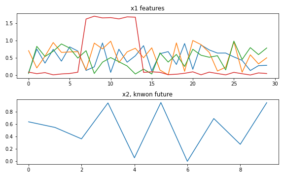
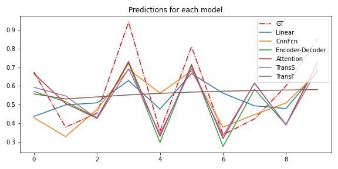
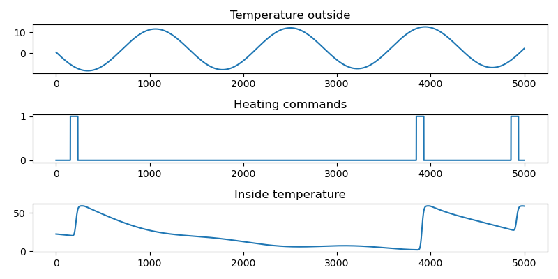
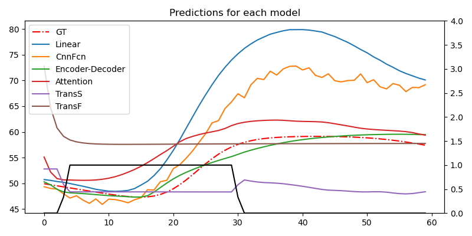

## sim0_experiments.ipynb

Notebook where we "test" the networks on a very nice dataset. The target is a linear combination between some features
from the past and the known future.

Here is an example:

From 4 features the 4'th (red line) is an "indicator", showing which of the other 3 
are relevant for the output. The model have to pick this up, combine it with the known future
 and make a prediction for the next time steps.
 
Here are the predictions for the six models:

Almost all models manage to get something meaningfull out. Except the full Transformer architecture, that just
follows some sort of average. At least the linear model struggles to output something correlated.

## sim1_experiments.ipynb

Here we take the simulation up a noch and use some very crude temperature equation and some random
commands issued to the system. 

The "main" use case for the paper is a household. So you have an environment
that can be cooler or warmer (with daily and yearly variations) and a heating element trying to keep things,
well, ok. There is no feedback simulated here. The system exchanges heat with a delay. So there is a delay
between when the command was issued and when the system started to feel the heat.  

Here is a sample of data:

Note the sinusoidal oscilation of the temperature outside (horizontal scale is minutes), some random commands
and the end temperature in the system (our ML target)

On a larger timespan, this is the data:

This data is cutted and prepared for the ML systems. The whole "year" is split at ~90% keeping the temporal ordering.

The results are below, for one little sample:

 
Note that we plotted only the "future".
The black line is the known command that will be sent to the system (1 == in that minute, the heater is ON).
This information is known to the ML system for each instance.

The red dotted line is the target, the ground thruth, the value that needs to be predicted. This is NOT sent
to the ML system. It is used to compute a loss and train the model.

The rest of the lines are responses from the six architectures. 

Note that the training mechanism (callbacks, losses, etc) are very similar to the one employed on the real data.
The difference is the running harness (hyperparameter search, more validation sets, more iterations). 

## network_definitions.py

The definitions for the six networks. Note that the number of input features can be selected (eg x1)
but the number of features in the known future or the feature size of the target is fixed.

This, can be changed, of course. Create an issue if you think it is relevant.

Head to the tests to see some sample input/output shapes for each model. Also, see the paper for 
nice drawings of the architectures.

## dataprocessing.py

Fast.ai v2 have a nice pipeline like structure to preprocess the data. In this file is the definition
of the main step in this pipeline. Key element is that the target y is offseted so the model needs to predict 
values around 0. Common practice.

Also, the Transformers require a special input, they need to see the shifted target in order to learn.

## sim1_datagen.py

As the name says, this file contains tools for generating the sim1 dataset.

  

